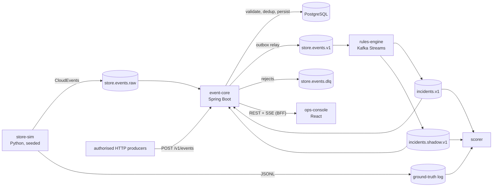
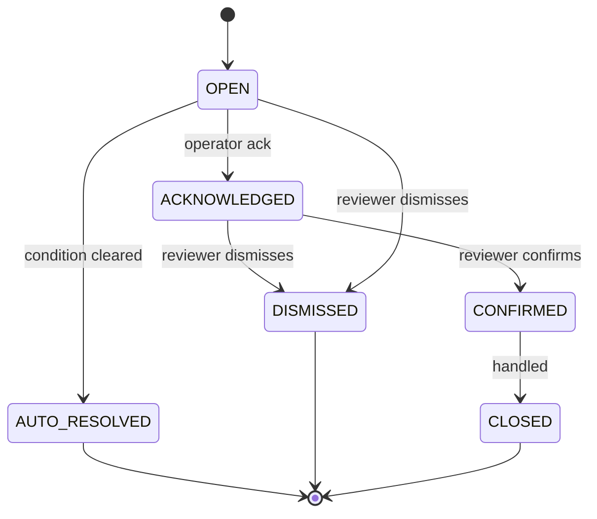

> **Implementation status (Tier 1 build).** This is the target architecture. The repository implements it with these deliberate gaps and substitutions for the local stack. Each one is a tracked follow-up, not a silent omission.
>
> **Time semantics.**
> - rules-engine keeps its own per-(store, run) watermark (stream time − grace) and a reorder buffer inside the state store, instead of Kafka Streams windows (§8.2).
> - Wall-clock punctuation drives only the liveness heartbeat and idle-state eviction.
>
> **Scorer.**
> - Matching is greedy one-to-one by smallest time distance inside the match window, not Hungarian (§10.1).
> - Latency is measured in event time. Wall-clock processing latency is not reported yet.
>
> **Internal transport security.**
> - Kafka uses SASL/SCRAM with per-service ACLs. PostgreSQL uses TLS with `verify-full`.
> - Service-to-service mTLS and Kafka TLS listeners are not enabled in the local compose stack (§11.2, §11.3).
> - Per-client event *type* allowlists are not enforced yet. Source-prefix allowlists are.
>
> **Secrets.** `scripts/bootstrap.sh` generates random local secrets into a git-ignored `.env`. SOPS or Vault integration is not wired (§11.6).
>
> **Supply chain.** CI runs gitleaks, Trivy (filesystem and images) and CodeQL. SBOM generation, cosign signing and SLSA provenance are not wired yet (§11.7).
>
> **Runtime hardening.**
> - Containers run non-root with all capabilities dropped and `no-new-privileges`.
> - Only the gateway has a read-only root filesystem. JVM images use `eclipse-temurin` JRE Alpine, not distroless, because the health checks need `wget`.
> - CPU and memory limits are not set in compose (§11.8).
>
> **Sessions.** Console sessions live in event-core memory, which suits a single instance. Use Spring Session (JDBC or Redis) before running more than one replica.

# Physical Intelligence Platform — Tier 1: Core Event Pipeline

> Event backbone for a camera-based physical intelligence and security platform, starting with retail.
> **Tier 1 has no cameras, no video, no ML, and no real people.** Every event is synthetic and produced by a deterministic simulator. The goal is to prove the pipeline — contract, ingest, rules, operator workflow, and measurement — before any sensor touches it.

| | |
|---|---|
| **Status** | Tier 1 — in development |
| **Services** | `event-core`, `store-sim`, `rules-engine`, `ops-console`, `scorer` |
| **Languages** | Java 21 LTS (Spring Boot 3.x, Kafka Streams), Python 3.12, TypeScript (React) |
| **Infra** | PostgreSQL 16+, Redpanda (Kafka API), Keycloak (OIDC), OpenTelemetry, Prometheus, Grafana |
| **Data class** | Synthetic only. Real-world data is rejected by design (see §12). |

---

## Table of contents

1. [Scope and non-goals](#1-scope-and-non-goals)
2. [Architecture](#2-architecture)
3. [Components](#3-components)
4. [Event contract](#4-event-contract)
5. [Data model](#5-data-model)
6. [Topics](#6-topics)
7. [store-sim](#7-store-sim)
8. [rules-engine](#8-rules-engine)
9. [ops-console](#9-ops-console)
10. [scorer](#10-scorer)
11. [Security architecture](#11-security-architecture)
12. [Privacy and safety](#12-privacy-and-safety)
13. [Reliability](#13-reliability)
14. [Observability and SLOs](#14-observability-and-slos)
15. [Testing strategy](#15-testing-strategy)
16. [CI/CD](#16-cicd)
17. [Local development](#17-local-development)
18. [Configuration](#18-configuration)
19. [Deployment](#19-deployment)
20. [Repository layout](#20-repository-layout)
21. [Architecture decision records](#21-architecture-decision-records)
22. [Roadmap and definition of done](#22-roadmap-and-definition-of-done)
23. [Runbooks](#23-runbooks)
24. [Glossary](#24-glossary)

---

## 1. Scope and non-goals

**In scope (Tier 1)**

- A versioned event contract based on CloudEvents 1.0 and JSON Schema 2020-12.
- A validating, deduplicating, durable ingest service with an append-only event store.
- A deterministic retail simulator that emits events and a ground-truth log.
- A stateful rules engine with event-time semantics, three rule classes (threshold, dwell, absence), and shadow mode.
- An operator console with a live store map, event stream, incident list, and review queue.
- A scorer that measures rule precision, recall, and latency against ground truth and gates CI.
- Production-grade security, observability, and operational practices from day one.

**Non-goals (Tier 1)**

- Video ingest, computer vision, edge devices, or model inference.
- Identification of any natural person. Not deferred — excluded permanently (§12).
- Multi-tenant billing, SSO federation beyond one IdP, or Kubernetes. These are designed for, not built.
- Automated actions of any kind. The system produces alerts for humans; it does not act.

---

## 2. Architecture



### Design principles

1. **One gate.** Every event, from any producer, passes through `event-core` validation and dedup before any consumer sees it. The rules engine never reads raw input.
2. **Event time, not wall time.** All rule logic is driven by the event's `time` attribute. Replaying the same input yields the same incidents.
3. **Durable before acknowledged.** A `202` from ingest or a committed Kafka offset means the event is committed in PostgreSQL.
4. **Idempotent everywhere.** Event IDs, incident IDs, and outbox records are deterministic, so retries and replays never create duplicates.
5. **Measured, not asserted.** No rule moves from shadow to enforce without scorer evidence.
6. **Humans decide.** Incidents are proposals for review. The system has no actuator.
7. **Least privilege, default deny.** Every service, database role, Kafka principal, and user role gets the minimum it needs.

---

## 3. Components

| Service | Responsibility | Stack | Inputs | Outputs |
|---|---|---|---|---|
| `event-core` | Ingest, schema validation, dedup, persistence, outbox relay, incident persistence, review API, console BFF | Java 21, Spring Boot 3.x, Flyway, networknt JSON Schema validator | HTTP, `store.events.raw`, `incidents.*` | PostgreSQL, `store.events.v1`, `store.events.dlq`, REST, SSE |
| `store-sim` | Deterministic discrete-event retail simulation | Python 3.12, NumPy, confluent-kafka | Layout + scenario YAML, seed | `store.events.raw` or file, ground-truth JSONL |
| `rules-engine` | Stateful rule evaluation in event time | Java 21, Kafka Streams (EOS v2), RocksDB | `store.events.v1` | `incidents.v1`, `incidents.shadow.v1` |
| `ops-console` | Operator UI | React, TypeScript, Vite, TanStack Query | `event-core` REST + SSE | Review actions |
| `scorer` | Precision / recall / latency against ground truth; CI gate | Python 3.12 | Ground truth, incidents | JSON, Markdown, JUnit XML |

---

## 4. Event contract

### 4.1 Envelope

CloudEvents 1.0, **structured mode**, `Content-Type: application/cloudevents+json`. Batches use `application/cloudevents-batch+json`.

| Attribute | Required | Rule |
|---|---|---|
| `specversion` | yes | Must be `1.0` |
| `id` | yes | Non-empty, ≤ 128 chars. UUID recommended; the simulator uses UUIDv5 |
| `source` | yes | URI-reference. Producer must be authorised for this source prefix (§11.2) |
| `type` | yes | Reverse-DNS, from the catalogue below. Unknown types are rejected |
| `time` | yes (stricter than spec) | RFC 3339, UTC (`Z`). Rejected if more than 5 min in the future or older than the late-arrival limit |
| `dataschema` | yes (stricter than spec) | Versioned schema URI; must match a registered schema |
| `datacontenttype` | yes | `application/json` |
| `subject` | conditional | Queue ID, zone ID, or pseudonymous track ID depending on type |
| `data` | yes | Validated against `dataschema` with `additionalProperties: false` |

**Extensions** (lowercase alphanumeric, per spec):

| Extension | Purpose |
|---|---|
| `storeid` | Store identifier; also the partition key |
| `partitionkey` | CloudEvents partitioning extension; always equal to `storeid` |
| `traceparent` | CloudEvents distributed-tracing extension (W3C Trace Context) |
| `simrunid` | Required when `source` is a simulator; identifies the seeded run |

### 4.2 Deduplication key

The dedup key is **(`source`, `id`)**, not `id` alone. The CloudEvents spec only guarantees `id` uniqueness within a `source`; deduplicating on `id` alone lets one producer suppress another's events.

| Case | Result |
|---|---|
| New (`source`, `id`) | Persisted, published, `202 Accepted` |
| Same (`source`, `id`), same payload hash | No-op, `200 OK` with `"status":"duplicate"` |
| Same (`source`, `id`), **different** payload hash | `409 Conflict`, security audit event, metric `ingest_conflicting_duplicates_total` |

The payload hash is SHA-256 over the RFC 8785 (JCS) canonical JSON of the full event, excluding `traceparent`.

### 4.3 Example

```json
{
  "specversion": "1.0",
  "id": "6f1d2c1e-9a3b-5c7e-8f00-3b1a2d4e5f60",
  "source": "urn:sim:store-sim/run/2c9f",
  "type": "com.pip.store.queue.length",
  "time": "2026-10-01T10:15:30Z",
  "subject": "queue:checkout-1",
  "dataschema": "https://schemas.pip.local/store/queue.length/1.0.0",
  "datacontenttype": "application/json",
  "storeid": "store-001",
  "partitionkey": "store-001",
  "simrunid": "2c9f",
  "traceparent": "00-4bf92f3577b34da6a3ce929d0e0e4736-00f067aa0ba902b7-01",
  "data": { "queueId": "checkout-1", "length": 7, "openRegisters": 1 }
}
```

### 4.4 Event catalogue (Tier 1)

| Type | Subject | Key `data` fields |
|---|---|---|
| `com.pip.store.zone.entered` | `track:<pseudonym>` | `zoneId` |
| `com.pip.store.zone.exited` | `track:<pseudonym>` | `zoneId` |
| `com.pip.store.queue.joined` | `queue:<id>` | `trackId` |
| `com.pip.store.queue.left` | `queue:<id>` | `trackId`, `served` (bool) |
| `com.pip.store.queue.length` | `queue:<id>` | `length`, `openRegisters` |
| `com.pip.store.register.opened` | `register:<id>` | `registerId` |
| `com.pip.store.register.closed` | `register:<id>` | `registerId` |
| `com.pip.store.clock.tick` | `store` | `seq` — heartbeat that advances stream time (§8.2) |

Track pseudonyms are simulator-generated, per-run, and carry no identity. See §12.

### 4.5 Schema governance

- Schemas live in `/schemas`, one file per type per version, JSON Schema 2020-12.
- Semantic versioning. Minor and patch versions must be **backward compatible** (additive optional fields only). A breaking change requires a new major version and a new `dataschema` URI; both versions are accepted during migration.
- CI runs a compatibility check on every schema change and fails on a breaking change without a major bump.
- `event-core` loads schemas at startup from the repo bundle. No remote schema fetching at runtime (prevents SSRF and schema poisoning).

---

## 5. Data model

All schema changes are Flyway migrations in `services/event-core/src/main/resources/db/migration`, applied by a separate one-shot job running as the `migrator` role. Application roles cannot run DDL.

### 5.1 Event store

```sql
-- Dedup index: small, unpartitioned, enforces (source, id) uniqueness globally.
CREATE TABLE event_dedup (
  source          text        NOT NULL,
  id              text        NOT NULL,
  payload_sha256  bytea       NOT NULL,
  first_seen_at   timestamptz NOT NULL DEFAULT now(),
  PRIMARY KEY (source, id)
);

-- Append-only event log, partitioned by receipt time.
CREATE TABLE event (
  event_seq       bigint      GENERATED ALWAYS AS IDENTITY,
  received_at     timestamptz NOT NULL DEFAULT now(),
  source          text        NOT NULL,
  id              text        NOT NULL,
  type            text        NOT NULL,
  subject         text,
  event_time      timestamptz NOT NULL,
  store_id        text        NOT NULL,
  dataschema      text        NOT NULL,
  data            jsonb       NOT NULL,
  payload_sha256  bytea       NOT NULL,
  sim_run_id      text,
  trace_id        text,
  PRIMARY KEY (received_at, event_seq)
) PARTITION BY RANGE (received_at);

CREATE INDEX ON event (store_id, event_time);
CREATE INDEX ON event (type, event_time);
```

Why a separate dedup table: a unique constraint on a partitioned table must include the partition key, which would make `(source, id)` uniqueness per-partition only. The unpartitioned `event_dedup` table enforces it globally.

**Ingest transaction** (single transaction, `READ COMMITTED`):

1. `INSERT INTO event_dedup ... ON CONFLICT DO NOTHING RETURNING 1`
2. If no row returned → load existing hash → return duplicate or `409`.
3. Otherwise `INSERT INTO event` and `INSERT INTO outbox`.
4. Commit, then respond.

Partitions are daily, created 7 days ahead by a scheduled job (pg_partman or a Flyway-managed function). Retention drops whole partitions; no row-level deletes.

### 5.2 Outbox

```sql
CREATE TABLE outbox (
  outbox_id     bigint GENERATED ALWAYS AS IDENTITY PRIMARY KEY,
  topic         text        NOT NULL,
  msg_key       text        NOT NULL,
  payload       jsonb       NOT NULL,
  headers       jsonb       NOT NULL DEFAULT '{}',
  created_at    timestamptz NOT NULL DEFAULT now(),
  published_at  timestamptz
);
CREATE INDEX outbox_unpublished ON outbox (outbox_id) WHERE published_at IS NULL;
```

The relay claims batches with `FOR UPDATE SKIP LOCKED`, publishes with an idempotent producer (`enable.idempotence=true`, `acks=all`), then sets `published_at`. Per-store ordering is preserved because messages are keyed by `storeid` and the relay publishes in `outbox_id` order per key. Published rows are purged after 72 h.

### 5.3 Incidents and review

```sql
CREATE TYPE incident_status AS ENUM
  ('OPEN','ACKNOWLEDGED','CONFIRMED','DISMISSED','AUTO_RESOLVED','CLOSED');

CREATE TABLE incident (
  incident_id    uuid        PRIMARY KEY,          -- deterministic, from rules-engine
  rule_id        text        NOT NULL,
  rule_version   text        NOT NULL,
  mode           text        NOT NULL CHECK (mode IN ('enforce','shadow')),
  store_id       text        NOT NULL,
  subject        text,
  severity       text        NOT NULL,
  opened_at      timestamptz NOT NULL,             -- event time
  resolved_at    timestamptz,
  status         incident_status NOT NULL DEFAULT 'OPEN',
  evidence       jsonb       NOT NULL,             -- triggering event refs, not copies
  version        integer     NOT NULL DEFAULT 0    -- optimistic concurrency
);

CREATE TABLE incident_review (
  review_id      bigint GENERATED ALWAYS AS IDENTITY PRIMARY KEY,
  incident_id    uuid        NOT NULL REFERENCES incident,
  actor_sub      text        NOT NULL,             -- OIDC subject
  action         text        NOT NULL,             -- ack | confirm | dismiss | close
  reason_code    text,
  note           text        CHECK (length(note) <= 2000),
  acted_at       timestamptz NOT NULL DEFAULT now()
);
```

`incident_review` is append-only. Review labels feed back into scoring in later tiers.

### 5.4 Audit log (tamper-evident)

```sql
CREATE TABLE audit_log (
  seq         bigint GENERATED ALWAYS AS IDENTITY PRIMARY KEY,
  at          timestamptz NOT NULL DEFAULT now(),
  actor       text        NOT NULL,
  action      text        NOT NULL,
  target      text,
  details     jsonb       NOT NULL DEFAULT '{}',
  prev_hash   bytea       NOT NULL,
  row_hash    bytea       NOT NULL                 -- sha256(prev_hash || canonical(row))
);
```

Each row chains to the previous one. A nightly job verifies the chain and alerts on any break. The chain head is exported daily to storage the application cannot write.

### 5.5 Append-only enforcement

```sql
REVOKE UPDATE, DELETE, TRUNCATE ON event, event_dedup, incident_review, audit_log FROM PUBLIC, app_ingest, app_review;
CREATE FUNCTION forbid_mutation() RETURNS trigger LANGUAGE plpgsql AS
$$ BEGIN RAISE EXCEPTION 'append-only table: %', TG_TABLE_NAME; END $$;
CREATE TRIGGER no_update BEFORE UPDATE OR DELETE ON audit_log
  FOR EACH ROW EXECUTE FUNCTION forbid_mutation();
```

(Same trigger on `event`, `event_dedup`, `incident_review`. Partition drops are done by `migrator` only.)

---

## 6. Topics

| Topic | Key | Partitions | Retention | Producer | Consumers |
|---|---|---|---|---|---|
| `store.events.raw` | `storeid` | 12 | 7 d | store-sim, trusted brokers-side producers | event-core |
| `store.events.v1` | `storeid` | 12 | 7 d | event-core (outbox) | rules-engine |
| `store.events.dlq` | `source` | 3 | 30 d | event-core | ops (replay tool) |
| `incidents.v1` | `storeid` | 6 | 30 d | rules-engine | event-core, scorer |
| `incidents.shadow.v1` | `storeid` | 6 | 30 d | rules-engine | event-core, scorer |
| `rules-engine-*-changelog` | internal | = source | compacted | rules-engine | rules-engine |

- Replication factor 3 and `min.insync.replicas=2` in staging/prod; 1 locally.
- DLQ records carry headers: `dlq-reason`, `dlq-stage`, `dlq-original-topic`, `dlq-original-offset`, `dlq-at`.
- Topics are created by IaC (`deploy/topics.yaml`), never by auto-create (`auto_create_topics_enabled=false`).

---

## 7. store-sim

### 7.1 Model

- **Layout** (`sim/layouts/*.yaml`): zones as a graph with coordinates for the console map, queues, registers, restricted zones.
- **Arrivals**: non-homogeneous Poisson process with an hourly rate profile.
- **Movement**: Markov chain over zones with per-zone dwell-time distributions (lognormal).
- **Checkout**: queues with configurable service-time distributions; a staffing policy that opens registers after a configurable reaction delay.
- **Scenarios** (`sim/scenarios/*.yaml`): scripted conditions layered on the base model — rush hour, register-opening delay (produces absence-rule positives), long dwell in restricted zone, plus fault injection: duplicate events, out-of-order delivery within a bounded skew, late events beyond grace, malformed events.

### 7.2 Determinism contract

**Same seed + same layout + same scenario + same sim version ⇒ byte-identical event file and ground-truth file.**

- One root `numpy.random.SeedSequence(seed)`, spawned into independent child generators per subsystem (arrivals, movement, service, faults). Adding a fault stream does not perturb arrival draws.
- Discrete-event engine on a simulated clock (`heapq`). **No wall-clock reads** anywhere in the model.
- Event IDs: `uuid5(NAMESPACE, f"{simrunid}:{seq}")`. Timestamps derive from a configured sim epoch.
- Canonical serialisation: RFC 8785 JCS, integers or fixed-precision decimals only (no raw float `repr`).
- Kafka output is a transport of the same ordered sequence. Determinism is asserted on the file output; Kafka delivery is keyed by `storeid` so per-store order is preserved.
- Lockfile-pinned dependencies (`uv.lock`); the sim version is stamped into every run manifest.

### 7.3 Outputs

- `events.jsonl` (when `--sink file`) or `store.events.raw` (when `--sink kafka`), optionally both.
- `ground_truth.jsonl`: one record per true episode:
  ```json
  {"gtId":"...","ruleClass":"queue_threshold","storeId":"store-001","key":"checkout-1",
   "onset":"2026-10-01T10:14:05Z","end":"2026-10-01T10:21:40Z","attrs":{"peakLength":9}}
  ```
- `manifest.json`: seed, sim version, layout/scenario hashes, event count, SHA-256 of both output files.
- `store.clock.tick` every 10 s of sim time per store (§8.2).

**Done when:** `make sim-determinism` runs the same seed twice and the manifests' hashes match. Runs in CI.

---

## 8. rules-engine

### 8.1 Topology

`store.events.v1` → timestamp extractor (CloudEvent `time`) → branch by `type` → per-rule processors with RocksDB state stores → incident emitter → `incidents.v1` or `incidents.shadow.v1` by rule mode.

- `processing.guarantee=exactly_once_v2` (Redpanda transactions enabled).
- `num.standby.replicas=1` outside local.
- Events are keyed by `storeid`, so all of a store's events and state live in one task.

### 8.2 Time semantics (and why "watermarks" means something specific here)

Kafka Streams has no Flink-style watermarks. It tracks **stream time** per task: the highest event timestamp observed so far. Windows close at `window end + grace`; records arriving later than that are dropped and counted (`dropped-records` metric). In this project:

- **Effective watermark** = stream time − grace. Default grace: 30 s, configurable per rule.
- **Out-of-order within grace**: accepted and handled correctly.
- **Late beyond grace**: dropped from rule evaluation, still stored by event-core, counted, and reported by the scorer.
- **Absence detection** uses a `PunctuationType.STREAM_TIME` punctuator. Stream time only advances when records arrive, so a quiet store would never fire an absence rule. The `store.clock.tick` heartbeat guarantees it advances.
- Wall-clock punctuation is **not** used for rule decisions: it makes output depend on processing speed and breaks replay determinism. It is used only for the liveness check (§12.4).

### 8.3 Rules (Tier 1)

| ID | Class | Logic | Key state |
|---|---|---|---|
| `R-QUEUE-001` | Threshold | `queue.length ≥ N` continuously for `≥ sustain`. Opens incident. Clears when `length ≤ N − hysteresis` for `≥ clear_sustain` (prevents flapping) | Per `(store, queue)`: breach start, current state |
| `R-DWELL-001` | Dwell | Track in a configured zone longer than `limit` between `zone.entered` and `zone.exited`. Session TTL closes sessions with no exit | Per `(store, track, zone)`: entry time |
| `R-ABS-001` | Absence | When `R-QUEUE-001` opens for a store, expect `register.opened` for that store within **300 s** event time. If none, open an escalation incident. Cancelled if the queue clears first | Per `store`: pending expectations with deadlines |

### 8.4 Rule configuration

`services/rules-engine/rules.yaml`, versioned in Git, changed only by PR with review:

```yaml
- id: R-ABS-001
  version: 1.2.0
  mode: shadow          # enforce | shadow | off
  severity: medium
  params:
    trigger: R-QUEUE-001
    expect: com.pip.store.register.opened
    within: PT300S
    grace: PT30S
```

`rule_version` is stamped on every incident. `mode: off` is the per-rule kill switch.

### 8.5 Shadow mode

- Shadow rules run the same code path on the same input.
- Output goes to `incidents.shadow.v1`. Shadow incidents are persisted but never enter the operator review queue; admins see them in a separate Shadow view.
- **Promotion to enforce requires**: scorer results meeting thresholds across the full scenario matrix, plus a documented review in the PR that flips `mode`.

### 8.6 Incident identity

`incident_id = uuid5(NS, f"{rule_id}:{rule_major}:{storeid}:{key}:{onset_event_time}")`. Replays and restarts produce the same ID; event-core upserts on it. Updates (e.g. resolution) are separate events referencing the ID.

---

## 9. ops-console

### 9.1 Features

- **Store map**: SVG floor plan rendered from the layout YAML; zones colour by occupancy, queues show live length, open incidents pinned to location.
- **Live event stream**: SSE, ring buffer of the latest 500 events, filter by type/zone, pause/resume. Server-side throttling protects the browser.
- **Incident list**: filter by status, rule, severity, store; sorted by event time.
- **Review queue**: acknowledge, confirm, dismiss. Dismiss requires a reason code (`false_positive`, `duplicate`, `expected_activity`, `test`, `other` + note).
- **Shadow view** (admin only).
- **Degraded banner** when the pipeline heartbeat is stale (§12.4).

### 9.2 Incident lifecycle



Transitions are validated server-side. Each transition writes `incident_review` and `audit_log` rows in the same transaction. Concurrent edits use `If-Match` ETags from `incident.version`; stale writes get `412`.

### 9.3 Frontend security

- Auth via BFF pattern: `event-core` runs the OIDC Authorization Code + PKCE flow. Tokens never reach the browser; the session is an `HttpOnly; Secure; SameSite=Strict` cookie.
- CSRF token on all state-changing requests.
- Strict CSP: `default-src 'self'; script-src 'self'; object-src 'none'; frame-ancestors 'none'; base-uri 'none'`. No inline scripts.
- No `dangerouslySetInnerHTML`. All event data rendered as text.
- `npm ci` with lockfile, `npm audit` and dependency review in CI.

---

## 10. scorer

### 10.1 Matching

Per rule class, per store and key:

- An incident **matches** a ground-truth episode if its event-time onset falls within `[gt.onset − tolerance_before, gt.onset + max_latency]`.
- One-to-one assignment (Hungarian algorithm on time distance; greedy fallback for large sets).
- Unmatched incidents = false positives. Unmatched episodes = false negatives.

### 10.2 Metrics

| Metric | Definition |
|---|---|
| Precision | TP / (TP + FP) |
| Recall | TP / (TP + FN) |
| F1 | Harmonic mean |
| Detection latency (event time) | `incident.opened_at − gt.onset`, p50 / p95 / max |
| Processing latency (wall time) | Emit time − ingest time, p50 / p95 (e2e runs only) |
| Late-drop rate | Events dropped past grace / total |
| Flap rate | Incidents reopened within `clear_sustain` / total |

Reported per rule, per scenario, per mode (enforce vs shadow).

### 10.3 Scenario matrix

Seeds × scenarios: `baseline`, `rush_hour`, `register_delay`, `restricted_dwell`, `duplicates`, `out_of_order`, `late_beyond_grace`, `malformed`. Fixed seed list in `scorer/matrix.yaml`.

### 10.4 CI gates

`scorer/thresholds.yaml`:

```yaml
R-QUEUE-001: { precision: 0.95, recall: 0.95, latency_p95: PT90S }
R-DWELL-001: { precision: 0.95, recall: 0.95, latency_p95: PT30S }
R-ABS-001:   { precision: 0.90, recall: 0.95, latency_p95: PT45S }
regression:  { max_drop_pp: 2.0 }   # vs latest main baseline
```

Outputs: `score.json`, `score.md` (posted as PR comment), `junit.xml`. Fails the build on threshold miss or regression.

---

## 11. Security architecture

### 11.1 Threat model (STRIDE, Tier 1)

| Threat | Example | Mitigation |
|---|---|---|
| **Spoofing** | Producer emits events claiming another store's `source` | Per-producer `source` prefix allowlist bound to its credential; mTLS/OAuth2 client identity; Kafka ACLs |
| **Spoofing** | Stolen console session | OIDC with MFA for reviewer/admin, short sessions, SameSite cookies, re-auth for admin actions |
| **Tampering** | Altering stored events or review history | Append-only tables, revoked privileges, triggers, hash-chained audit log with external head export |
| **Tampering** | Conflicting replay of an existing event ID | `409` on hash mismatch, security audit event, alert |
| **Tampering** | Malicious rule change | Rules in Git, branch protection, required review, signed commits, `rule_version` on incidents |
| **Repudiation** | Reviewer denies dismissing an incident | Every action tied to OIDC `sub`, recorded in `incident_review` and `audit_log` |
| **Information disclosure** | Kafka or Postgres exposed publicly | Private network only; TLS everywhere; no public ports except the reverse proxy |
| **Information disclosure** | Secrets in repo or logs | Secret scanning, SOPS/Vault, structured logging with payload redaction |
| **Denial of service** | Ingest flood | Rate limits per client, payload size caps, bounded queues, `429` + `Retry-After`, Kafka quotas |
| **Denial of service** | Stream-time stall (no ticks) | Liveness heartbeat, degraded banner, alert |
| **Elevation of privilege** | App role runs DDL or deletes | Separate `migrator` role; app roles have no DDL/DELETE; no superuser connections |
| **Elevation of privilege** | Vulnerable dependency | SCA scanning, Renovate, SBOM, image scanning, minimal images |

Full model: `docs/security/threat-model.md`, reviewed at every tier boundary.

### 11.2 Identity and access

**Humans** — OIDC (Keycloak). MFA required for `reviewer` and `admin`.

| Role | Read events/map | Read incidents | Ack | Confirm/dismiss | Shadow view | Rule/config admin |
|---|---|---|---|---|---|---|
| `viewer` | ✓ | ✓ | | | | |
| `operator` | ✓ | ✓ | ✓ | | | |
| `reviewer` | ✓ | ✓ | ✓ | ✓ | | |
| `admin` | ✓ | ✓ | ✓ | ✓ | ✓ | ✓ (via Git) |

**Services** — mTLS on internal traffic with certificates from an internal CA (step-ca), rotated automatically (≤ 30 days). External HTTP producers use OAuth2 client credentials; each client registration carries an allowed `source` prefix list and allowed `type` list, enforced at ingest.

### 11.3 Kafka / Redpanda

- TLS for all listeners; SASL/SCRAM-SHA-512 per service principal.
- ACLs (default deny):

| Principal | Topic | Operations |
|---|---|---|
| `store-sim` | `store.events.raw` | Write |
| `event-core` | `store.events.raw`, `incidents.*` | Read |
| `event-core` | `store.events.v1`, `store.events.dlq` | Write |
| `rules-engine` | `store.events.v1` | Read |
| `rules-engine` | `incidents.*`, own internal topics | Write / Read / Create (prefixed) |
| `scorer` | `incidents.*` | Read |

- Producer quotas per principal. Admin API not reachable from application networks.

### 11.4 PostgreSQL

- TLS required, clients use `sslmode=verify-full`.
- Roles: `migrator` (DDL, Flyway only), `app_ingest` (INSERT on event/dedup/outbox, UPDATE `outbox.published_at` only), `app_review` (incident updates, INSERT review/audit), `app_read` (SELECT), `scorer_read` (SELECT on incidents). No app connects as owner or superuser.
- `event_dedup`, `event`, `incident_review`, `audit_log` are append-only (§5.5).
- Row-level security on `store_id → tenant_id` is designed in for multi-tenancy (Tier 2+).
- Connection limits per role; `statement_timeout` and `idle_in_transaction_session_timeout` set per role.

### 11.5 API hardening (`event-core`)

- Max body 64 KB per event, 1 MB per batch, max 500 events per batch.
- Strict content-type checking; reject unknown fields (`additionalProperties: false` at envelope and data level).
- Rate limiting per client ID (token bucket) and per IP at the proxy.
- Input bounds on every string and number in schemas (`maxLength`, `minimum`, `maximum`).
- Uniform error format (RFC 9457 Problem Details). No stack traces or internal detail in responses.
- Security headers on all responses: HSTS, `X-Content-Type-Options: nosniff`, `Referrer-Policy: no-referrer`, CSP on console routes.
- Actuator endpoints on a separate management port, never exposed publicly.
- OpenAPI 3.1 spec in `services/event-core/openapi.yaml`, contract-tested in CI.

### 11.6 Secrets

- No secrets in Git, images, or environment files committed to the repo. `.env` is gitignored; `.env.example` has placeholders only.
- Deployed secrets via SOPS-encrypted files (age keys) or HashiCorp Vault; injected at runtime.
- Rotation: DB and Kafka credentials every 90 days, certificates ≤ 30 days, immediate on suspected compromise (runbook RB-07).
- gitleaks in pre-commit and CI.

### 11.7 Supply chain

- Dependency lockfiles for every ecosystem (Gradle lockfile, `uv.lock`, `package-lock.json`).
- Renovate for updates; CI blocks on critical CVEs (OWASP Dependency-Check / osv-scanner).
- SAST: CodeQL (Java, Python, TypeScript).
- SBOM (CycloneDX via Syft) for every image; images scanned with Trivy.
- Images signed with cosign; deployment verifies signatures. Build provenance attestation targeting SLSA Level 2.
- Base images pinned by digest.
- GitHub Actions pinned by commit SHA; `permissions:` minimised per workflow.

### 11.8 Runtime and host

- Containers: distroless or minimal base, non-root UID, read-only root filesystem, all Linux capabilities dropped, `no-new-privileges`, CPU/memory limits.
- Host (VPS): SSH key auth only, root login disabled, firewall default-deny with only 443 (and SSH from an allowlist) open, fail2ban, unattended security upgrades, disk encryption where the provider supports it.
- Only the reverse proxy (Traefik via Dokploy) is internet-facing. PostgreSQL, Redpanda, Keycloak admin, Prometheus, and Grafana are on private networks.
- TLS 1.2+ only (1.3 preferred) with automatic certificate renewal.

### 11.9 Audit

Logged to `audit_log` (hash-chained): authentication events, role changes, every incident transition, rule mode changes (recorded on deploy), conflicting-duplicate detections, DLQ replays, config changes. Audit records are retained 1 year minimum and never contain event payloads.

### 11.10 Vulnerability disclosure

See `SECURITY.md`: private reporting channel, acknowledgement within 72 h, coordinated disclosure.

---

## 12. Privacy and safety

### 12.1 Tier 1 data classification

Tier 1 processes **synthetic data only**. Enforced, not assumed:

- `event-core` rejects any event whose `source` is not in the configured allowlist.
- Simulator sources must carry `simrunid`.
- Staging and production ingest configs contain no real-site sources in Tier 1.

### 12.2 Permanent commitments (bind all future tiers)

These are architectural constraints, not policy aspirations. Changing any of them requires an ADR and external review.

1. **No identification of people.** No facial recognition, no biometric templates, no re-identification across visits or sites. Track IDs are ephemeral per-session pseudonyms.
2. **Incidents describe situations, not persons.** "Queue at checkout-1 above threshold for 4 min", never a judgement about an individual.
3. **Human in the loop.** The platform has no actuators and triggers no automated action against any person. Every incident is a proposal for human review.
4. **Neutral alert language.** Rule names and messages are reviewed for loaded or accusatory wording.
5. **Data minimisation.** Evidence fields reference event IDs; they do not copy payloads. Future video tiers default to on-edge processing and emit events, not footage.
6. **Retention limits** (§12.3), enforced by partition drops.
7. **Regulatory readiness.** Designed for India's Digital Personal Data Protection Act, 2023 (notice, purpose limitation, retention, data principal rights, breach reporting) and GDPR where applicable. Crypto-shredding of per-subject keys is the planned mechanism for erasure on append-only storage. Legal review is required before any real-site deployment.

### 12.3 Retention (Tier 1 defaults)

| Data | Retention |
|---|---|
| `event` partitions | 30 days |
| Kafka event topics | 7 days |
| DLQ | 30 days |
| Incidents and reviews | 1 year |
| Audit log | 1 year minimum |
| Scorer reports | Kept as CI artifacts, 90 days |

### 12.4 Operational safety

- **Silence is not "all clear."** `rules-engine` emits a liveness heartbeat per store; the console shows a degraded banner and ops is alerted if stream time stalls or the heartbeat is stale beyond 60 s.
- **Alert fatigue budget.** Per-store rate limit on new incidents per rule; excess is aggregated into one summary incident and flagged.
- **Shadow before enforce** (§8.5), with scorer evidence.
- **Kill switch** per rule (`mode: off`) and a global pause on incident publishing.

---

## 13. Reliability

### 13.1 Delivery guarantees

| Hop | Guarantee | Mechanism |
|---|---|---|
| Producer → ingest (HTTP) | At-least-once from client; effectively-once stored | Client retries; dedup on (`source`, `id`) |
| `store.events.raw` → event-core | At-least-once; effectively-once stored | Offset committed after DB commit; dedup |
| event-core → `store.events.v1` | At-least-once, per-store ordered | Transactional outbox + idempotent producer |
| `store.events.v1` → incidents | Exactly-once within Kafka | Kafka Streams EOS v2 |
| incidents → Postgres | Effectively-once | Upsert on deterministic `incident_id` |

### 13.2 Backpressure and failure handling

- HTTP ingest: bounded worker pool; `429` with `Retry-After` when saturated; DB pool exhaustion never blocks request threads indefinitely.
- Kafka consumer: pauses partitions when downstream is slow; lag is alerted, not hidden.
- Validation failures → DLQ with reason headers. `tools/dlq-replay` re-submits after fixes, through the normal gate.
- Poison messages in rules-engine: deserialisation exception handler routes to DLQ; the stream continues.

### 13.3 Failure modes

| Failure | Effect | Recovery |
|---|---|---|
| Postgres down | Ingest returns `503`; raw consumer pauses | Resumes automatically; no data loss |
| Redpanda down | Outbox accumulates; HTTP ingest still commits | Relay drains on recovery |
| rules-engine crash | Incidents paused; degraded banner | State restored from changelogs; standby takes over |
| event-core crash mid-transaction | Transaction rolled back; client retries | Dedup absorbs retries |
| Clock skew at producer | Events rejected if > 5 min in future | Producer fixes NTP; runbook RB-04 |

### 13.4 Backup and disaster recovery

- PostgreSQL: point-in-time recovery (Neon built-in; pgBackRest for self-hosted) with WAL archiving to off-host storage.
- Targets (Tier 1): **RPO ≤ 5 min, RTO ≤ 1 h**.
- Restore drill monthly, recorded in `docs/runbooks/restore-log.md`.
- Kafka is not the system of record; events can be re-published from Postgres via `tools/republish`.

---

## 14. Observability and SLOs

### 14.1 Tracing

OpenTelemetry in all services. `traceparent` travels in the CloudEvents extension and in Kafka headers, so one trace spans producer → ingest → DB → outbox → rules-engine → incident → console.

### 14.2 Metrics (Prometheus)

| Metric | Service |
|---|---|
| `ingest_events_total{result=accepted,duplicate,conflict,invalid}` | event-core |
| `ingest_latency_seconds` (histogram) | event-core |
| `outbox_unpublished_rows`, `outbox_oldest_age_seconds` | event-core |
| `dlq_events_total{reason}` | event-core |
| Kafka Streams `dropped-records`, `process-latency`, commit latency | rules-engine |
| `stream_time_lag_seconds{store}` (wall − stream time) | rules-engine |
| `incidents_emitted_total{rule,mode}` | rules-engine |
| `consumer_lag{group,topic}` | all consumers |
| `review_actions_total{action,reason}` | event-core |

### 14.3 Logging

Structured JSON, UTC, with `trace_id`, `span_id`, `service`, `version`. Event `data` is never logged at INFO or above. Secrets and tokens are redacted by a logging filter tested in CI.

### 14.4 SLOs (Tier 1)

| SLO | Target |
|---|---|
| Ingest availability | 99.9 % over 30 days |
| Ingest latency | p99 < 100 ms (single event) |
| End-to-end latency (event ingest → incident persisted) | p95 < 2 s |
| Accepted-event durability | 100 % (no acknowledged event lost) |
| Console live-stream delay | p95 < 1 s |

Burn-rate alerts (multi-window) on each SLO. Platform alerts: consumer lag, outbox age, DLQ rate spike, conflicting duplicates, stream-time stall, audit chain break, certificate expiry < 7 days.

---

## 15. Testing strategy

| Layer | Tooling | What it proves |
|---|---|---|
| Unit | JUnit 5, pytest, Vitest | Pure logic, state transitions |
| Property-based | jqwik, Hypothesis | Dedup idempotence, rule invariants under reordering within grace, sim determinism |
| Schema contract | Schema compatibility check, sample corpus | No breaking schema changes; every catalogue type has valid and invalid fixtures |
| Topology | Kafka Streams `TopologyTestDriver` | Rules against controlled timestamps, grace, late data, punctuation |
| Integration | Testcontainers (PostgreSQL, Redpanda) | Ingest transaction, outbox relay, consumer commit ordering |
| API contract | OpenAPI-driven tests | Server matches published spec |
| End-to-end | Docker Compose + seeded sim + scorer | Whole pipeline meets thresholds |
| UI | Playwright | Review flows, auth, degraded banner |
| Security | CodeQL, gitleaks, Trivy, OWASP ZAP baseline against staging | Known-bad patterns and misconfigurations |
| Resilience | Kill/restart containers during e2e runs | No lost or duplicated incidents across crashes |
| Load | k6 against ingest | SLO headroom, `429` behaviour |

---

## 16. CI/CD

**On every PR**

1. Lint and format (Spotless, Ruff, ESLint/Prettier).
2. Secret scan, dependency scan, CodeQL.
3. Unit, property, topology, and schema-compatibility tests.
4. Integration tests (Testcontainers).
5. Sim determinism check.
6. Fast offline scoring: sim → file → `TopologyTestDriver` → scorer on the full matrix. Gate on thresholds and regression.
7. Build images, generate SBOM, scan.

**On merge to `main`**

8. Full e2e run in Compose with fault injection.
9. Sign images (cosign), push by digest, record provenance.
10. Deploy to staging, run smoke tests and ZAP baseline.
11. Update the scorer baseline.

**Release**: tag-driven, semantic versioning per service, promotion to production by digest (never rebuild), manual approval gate.

Branch protection: required reviews, required checks, signed commits, linear history, no force-push to `main`.

---

## 17. Local development

### Prerequisites

Docker (with Compose), JDK 21, Python 3.12 with `uv`, Node.js LTS. A `.devcontainer/` is provided and is the recommended path (GitHub Codespaces, 4-core minimum; 8-core for full e2e).

### Quick start

```bash
cp .env.example .env
make up                 # postgres, redpanda, keycloak, otel, prometheus, grafana
make migrate            # Flyway as migrator role
make topics             # create topics + ACLs from deploy/topics.yaml
make run                # event-core, rules-engine, ops-console
make sim SEED=42 SCENARIO=register_delay
make score SEED=42 SCENARIO=register_delay
```

Open the console, log in with a seeded dev user, and watch the queue build and the absence rule escalate.

### Useful targets

| Target | Purpose |
|---|---|
| `make sim-determinism` | Same seed twice, compare hashes |
| `make score-matrix` | Full scenario matrix offline |
| `make e2e` | Compose-based end-to-end with scoring |
| `make dlq-replay` | Re-submit DLQ events |
| `make down-v` | Stop everything and wipe volumes |

### Local ports

| Service | Port |
|---|---|
| ops-console | 5173 |
| event-core API / BFF | 8080 |
| event-core management | 8081 (localhost only) |
| rules-engine management | 8082 (localhost only) |
| PostgreSQL | 5432 |
| Redpanda Kafka API | 19092 |
| Redpanda Console | 8088 |
| Keycloak | 8180 |
| Grafana | 3000 |
| Prometheus | 9090 |

---

## 18. Configuration

All configuration via environment variables (12-factor); secrets via the secret store in deployed environments.

| Variable | Service | Description |
|---|---|---|
| `PIP_DB_URL` | event-core | JDBC URL, `sslmode=verify-full` outside local |
| `PIP_DB_USER` / `PIP_DB_PASSWORD` | event-core | Per-role credentials |
| `PIP_KAFKA_BOOTSTRAP` | all | Broker list |
| `PIP_KAFKA_SASL_USER` / `PIP_KAFKA_SASL_PASSWORD` | all | SCRAM credentials |
| `PIP_ALLOWED_SOURCES` | event-core | Source prefix allowlist |
| `PIP_MAX_FUTURE_SKEW` | event-core | Default `PT5M` |
| `PIP_OIDC_ISSUER` / `PIP_OIDC_CLIENT_ID` / `PIP_OIDC_CLIENT_SECRET` | event-core | BFF OIDC client |
| `PIP_RULES_FILE` | rules-engine | Path to `rules.yaml` |
| `PIP_STREAMS_STATE_DIR` | rules-engine | RocksDB directory (persistent volume) |
| `OTEL_EXPORTER_OTLP_ENDPOINT` | all | Collector endpoint |
| `SIM_SEED` / `SIM_LAYOUT` / `SIM_SCENARIO` / `SIM_SINK` | store-sim | Run parameters |

Services fail fast at startup on missing or invalid configuration.

---

## 19. Deployment

| Environment | Purpose | Platform |
|---|---|---|
| `local` | Development | Docker Compose / Codespaces |
| `ci` | Tests and scoring | GitHub Actions + Compose |
| `staging` | Integration, security scans | VPS with Dokploy, Neon or self-hosted Postgres |
| `production` | Tier 1 demo / pilot (synthetic only) | Same as staging, separate credentials and network |

Kubernetes is deferred (ADR-009). Manifests are written so that migration is a packaging change, not a redesign: stateless services, externalised config, health/readiness probes, persistent volume only for Kafka Streams state.

Health endpoints: `/actuator/health/liveness` and `/actuator/health/readiness` on the management port. Readiness includes DB and Kafka connectivity.

---

## 20. Repository layout

```
.
├── schemas/                      # JSON Schemas, versioned, + fixtures (valid/invalid)
├── services/
│   ├── event-core/               # Spring Boot: ingest, outbox, incidents, BFF
│   │   ├── src/main/resources/db/migration/   # Flyway
│   │   └── openapi.yaml
│   └── rules-engine/             # Kafka Streams
│       └── rules.yaml
├── sim/
│   ├── store_sim/                # Python package
│   ├── layouts/
│   └── scenarios/
├── scorer/
│   ├── matrix.yaml
│   └── thresholds.yaml
├── web/ops-console/              # React + TypeScript
├── deploy/
│   ├── compose/
│   ├── topics.yaml               # topics + ACLs as code
│   └── keycloak/                 # realm export (no secrets)
├── tools/                        # dlq-replay, republish, audit-verify
├── docs/
│   ├── adr/
│   ├── runbooks/
│   └── security/threat-model.md
├── .devcontainer/
├── .github/workflows/
├── Makefile
├── SECURITY.md
└── README.md
```

---

## 21. Architecture decision records

| ADR | Decision |
|---|---|
| 001 | CloudEvents 1.0 structured mode with required `time` and `dataschema` |
| 002 | Dedup key is (`source`, `id`) with payload-hash conflict detection |
| 003 | Separate unpartitioned dedup table beside a partitioned event table |
| 004 | Transactional outbox instead of dual writes |
| 005 | Kafka Streams over Flink for Tier 1 (operational simplicity, EOS, embedded state) |
| 006 | Stream-time punctuation plus heartbeat ticks for absence rules |
| 007 | Deterministic event and incident IDs (UUIDv5) |
| 008 | BFF authentication; no tokens in the browser |
| 009 | Compose + Dokploy for Tier 1; Kubernetes deferred |
| 010 | Permanent exclusion of person identification |

Template: context → decision → consequences → alternatives considered. New ADRs by PR.

---

## 22. Roadmap and definition of done

### Tier 1 milestones

**M1 — event-core**
- [ ] Schemas and fixtures for every catalogue type
- [ ] HTTP ingest (single and batch) and raw-topic consumer share one validation path
- [ ] Dedup with duplicate/conflict semantics, append-only store, outbox relay
- [ ] Flyway migrations, role separation, TLS
- **Done when:** it accepts, validates, and stores events; duplicates are no-ops; conflicts are `409`; invalid events reach the DLQ.

**M2 — store-sim**
- [ ] Layout, arrivals, movement, queues, registers, scenarios, fault injection
- [ ] Ground-truth log and manifest
- **Done when:** the same seed produces byte-identical output, checked in CI.

**M3 — rules-engine**
- [ ] Event-time extractor, grace, late-drop metrics
- [ ] `R-QUEUE-001`, `R-DWELL-001`, `R-ABS-001`
- [ ] Shadow mode, kill switch, deterministic incident IDs, EOS v2
- **Done when:** topology tests cover in-order, out-of-order, late, duplicate, and quiet-store cases.

**M4 — ops-console**
- [ ] OIDC via BFF, roles, store map, live stream, incident list, review queue, degraded banner
- **Done when:** you can watch a simulated queue build up, get alerted, and confirm or dismiss with a full audit trail.

**M5 — scorer**
- [ ] Matching, metrics, scenario matrix, thresholds, regression baseline, PR comment
- **Done when:** it runs in CI and blocks merges that miss thresholds or regress.

**Tier 1 exit criteria:** all milestones done; SLOs met on staging for 7 consecutive days; threat model reviewed; restore drill passed; zero critical vulnerabilities open.

### Beyond Tier 1 (preview)

Edge video processing that emits the **same event contract**, multi-tenancy with RLS, more rule classes, reviewer-label feedback into scoring, and a formal privacy impact assessment before any real site.

---

## 23. Runbooks

| ID | Runbook |
|---|---|
| RB-01 | Consumer lag rising |
| RB-02 | DLQ spike — triage and replay |
| RB-03 | Outbox backlog / Redpanda outage |
| RB-04 | Producer clock skew rejections |
| RB-05 | Stream-time stall / degraded banner |
| RB-06 | Conflicting-duplicate alert (possible spoofing) |
| RB-07 | Credential or key compromise — rotation |
| RB-08 | PostgreSQL point-in-time restore |
| RB-09 | Audit chain verification failure |
| RB-10 | Disable a rule (kill switch) |

Each runbook: symptoms → dashboards → diagnosis → mitigation → verification → follow-up.

---

## 24. Glossary

| Term | Meaning |
|---|---|
| **Stream time** | Highest event timestamp a Kafka Streams task has observed |
| **Grace** | How long after a window's end late events are still accepted |
| **Effective watermark** | Stream time − grace; events older than this are late |
| **Shadow mode** | Rule runs and is measured, but its incidents are not shown to operators |
| **Ground truth** | Simulator's record of what actually happened, used for scoring |
| **Outbox** | Table written in the same transaction as the event, relayed to Kafka afterwards |
| **Track pseudonym** | Ephemeral per-session ID with no link to any identity |
| **EOS v2** | Kafka Streams exactly-once processing guarantee |

---

*Security issues: see [`SECURITY.md`](SECURITY.md). Do not open public issues for vulnerabilities.*
