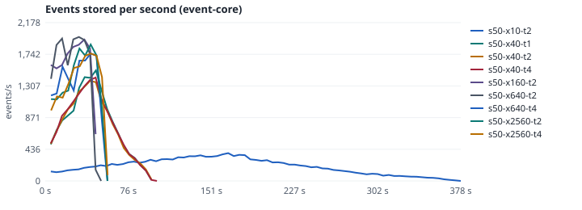
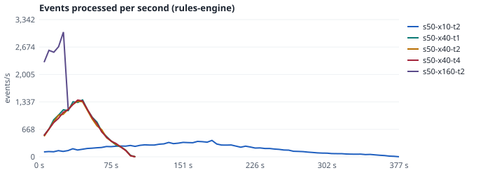
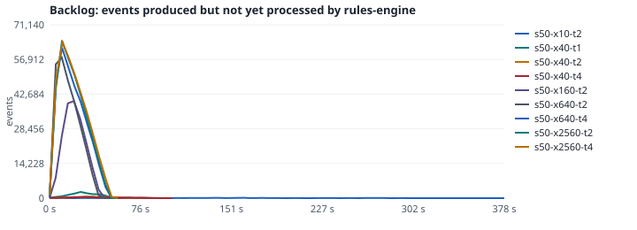

# Rules-engine scale test (milestone R5)

**Question:** how does the live pipeline (event-core ingest → Kafka → rules-engine → incidents) behave with
50 simulated stores at 10x real time, and where are the limits?

## Method

- `make scale` (harness: `scripts/scale.py`) simulates N copies of store-001 (`store-s001` … `store-sNNN`)
  in **one** run with the S2 `stores:` feature: rush-hour traffic (180 shoppers per hour per store), one
  register open at the start and slow staff reactions, so every store raises queue incidents. Events of all
  stores interleave in event-time order and are streamed to `store.events.raw` at SPEED x real time.
- While it runs, every 5 s: events handed to the producer, events stored by event-core (Postgres) and events
  received by rules-engine (`/metrics`). **Backlog** = produced − processed: the end-to-end queue. (Kafka's
  `records-lag-max` is also recorded, but it is a windowed gauge over every consumer of the app, restore and
  global-store consumers included, and stayed high while nothing was queued, so it is not used.)
- After the send: wait until every event is stored and seen by the rules engine, and every store's watermark
  has reached its horizon (from `pip.pipeline_heartbeat`), then until the incident count has not changed for
  15 s; missed and spurious episodes are listed, and the count is checked again 30 s after scoring.
- Then: incidents vs ground truth with the scorer's own matching (`pip_scorer.match.score`), the Q2
  wall-clock processing latency (decision event received → incident row, `pip_scorer.latency`), the
  rules-engine state directory size (`du` in the container) and its memory (`docker stats`).
- `make scale-ladder` runs threads 1/2/4 at 40x, then 10x and 160x at 2 threads; `make scale-stress` runs
  640x and 2560x at 2 and 4 threads (offered 10,000+ events/s) to find the saturation point. 50 stores,
  30 simulated minutes each; `scripts/scale_report.py` writes the table and three SVG charts.
- The numbers below come from the manual workflow `.github/workflows/scale.yml` on a GitHub-hosted
  `ubuntu-24.04` runner (its vCPU and memory are recorded with the results), which commits them to a review branch. They are measured,
  not estimated; the runner is shared hardware, so treat them as a floor, not a capacity guarantee.

## Results

Every sample is kept in `docs/perf/results/*.json`.

## Measured results (workflow run 37912484990, ladder `both`)

Host: 4 vCPU, 15.6 GB RAM (the whole stack shares it).

| Run | Stores | Speed | Threads | Events | Complete | Send s | Drained s | Produced avg/s | Stored peak/s | Rules peak/s | Backlog max | Latency p50 / p95 / max ms | State | Memory |
|---|---:|---:|---:|---:|:-:|---:|---:|---:|---:|---:|---:|---|---:|---|
| s50-x10-t2 | 50 | 10x | 2 | 74,232 | yes | 372.0 | 374.1 | 199.5 | 382.0 | 402.4 | 134 | 190 / 331 / 678 | 195.3 MB | 606MiB |
| s50-x40-t1 | 50 | 40x | 1 | 75,364 | yes | 93.0 | 95.1 | 810.3 | 1521.4 | 1524.9 | 2,550 | 409 / 819 / 1133 | 194.2 MB | 569.1MiB |
| s50-x40-t2 | 50 | 40x | 2 | 73,110 | yes | 93.0 | 95.1 | 786.0 | 1376.9 | 1430.8 | 629 | 332 / 666 / 762 | 194.9 MB | 573MiB |
| s50-x40-t4 | 50 | 40x | 4 | 74,173 | yes | 93.0 | 99.1 | 797.5 | 1422.4 | 1403.3 | 487 | 310 / 537 / 777 | 199.2 MB | 630.2MiB |
| s50-x160-t2 | 50 | 160x | 2 | 74,291 | yes | 23.3 | 45.7 | 3194.0 | 1944.9 | 1972.9 | 39,855 | 337 / 537 / 789 | 195.6 MB | 586.9MiB |
| s50-x640-t2 | 50 | 640x | 2 | 74,089 | yes | 7.1 | 47.8 | 10444.7 | 1980.0 | 2037.0 | 57,727 | 323 / 487 / 818 | 195.3 MB | 618.5MiB |
| s50-x640-t4 | 50 | 640x | 4 | 73,297 | yes | 7.7 | 54.5 | 9463.3 | 1752.5 | 1811.8 | 61,757 | 347 / 556 / 703 | 195.3 MB | 618.3MiB |
| s50-x2560-t2 | 50 | 2560x | 2 | 74,265 | yes | 8.5 | 53.3 | 8744.3 | 1877.3 | 1800.2 | 64,673 | 372 / 1525 / 1880 | 199.6 MB | 611.1MiB |
| s50-x2560-t4 | 50 | 2560x | 4 | 74,348 | yes | 7.5 | 54.4 | 9976.8 | 1752.9 | 1809.8 | 63,953 | 358 / 627 / 857 | 199.7 MB | 615MiB |

### Rule quality under load (incidents vs ground truth)

| Run | R-ABS-001 | R-DWELL-001 | R-FOOT-001 | R-QUEUE-001 |
|---|---|---|---|---|
| s50-x10-t2 | P 1.000 / R 1.000 (n=2) | P 1.000 / R 0.923 (n=13) | P 1.000 / R 1.000 (n=0) | P 1.000 / R 1.000 (n=55) |
| s50-x40-t1 | P 1.000 / R 1.000 (n=0) | P 1.000 / R 1.000 (n=17) | P 1.000 / R 1.000 (n=0) | P 1.000 / R 1.000 (n=54) |
| s50-x40-t2 | P 1.000 / R 1.000 (n=4) | P 1.000 / R 1.000 (n=17) | P 1.000 / R 1.000 (n=0) | P 1.000 / R 1.000 (n=61) |
| s50-x40-t4 | P 1.000 / R 1.000 (n=6) | P 1.000 / R 1.000 (n=29) | P 1.000 / R 1.000 (n=0) | P 1.000 / R 1.000 (n=61) |
| s50-x160-t2 | P 1.000 / R 1.000 (n=2) | P 1.000 / R 1.000 (n=15) | P 1.000 / R 1.000 (n=0) | P 1.000 / R 1.000 (n=58) |
| s50-x640-t2 | P 1.000 / R 1.000 (n=1) | P 1.000 / R 1.000 (n=12) | P 1.000 / R 1.000 (n=0) | P 1.000 / R 1.000 (n=51) |
| s50-x640-t4 | P 1.000 / R 1.000 (n=2) | P 1.000 / R 1.000 (n=22) | P 1.000 / R 1.000 (n=0) | P 1.000 / R 1.000 (n=54) |
| s50-x2560-t2 | P 1.000 / R 1.000 (n=2) | P 1.000 / R 1.000 (n=18) | P 1.000 / R 1.000 (n=0) | P 1.000 / R 1.000 (n=59) |
| s50-x2560-t4 | P 1.000 / R 1.000 (n=1) | P 1.000 / R 1.000 (n=25) | P 1.000 / R 1.000 (n=0) | P 1.000 / R 1.000 (n=55) |

### The one miss, and what it was

In the run above, `s50-x10-t2` scored one R-DWELL-001 episode as missed (12 of 13), with no false
positive; the other eight runs, and the first ladder (run 37907996142), were 1.000 everywhere. Incidents
reach Postgres through their own topic and consumer, so the heartbeat's watermark can be ahead of the
last incident row, and the harness then scored after only 4 s without change. It now waits for 15 s
without change, lists missed and spurious episodes, and re-counts 30 s after scoring. With that, a repeat
of the standard ladder (run 37915772707, `results/repeat-37915772707/`) scored **1.000 for every rule in
every run, nothing missed, nothing spurious, no incident arriving after scoring**. The live pipeline's
correctness under load is also gated on every PR by `make e2e-pipeline` (scorer, 0 misses allowed).

## What the numbers say

**Headline.** On one 4-vCPU, 16 GB runner that also hosts Postgres, Redpanda, Keycloak and the console, the
pipeline sustains **about 1,750–2,000 events per second end to end** (3,000/s peaks in the first ladder),
with every event stored exactly once, every rule at precision and recall 1.000 under load (one exception,
explained below), and an ingest-to-incident latency p95 of **0.3–0.8 s** (1.5 s in the most loaded run).
A rush-hour store produces about 0.8 events per second, so one node of this size handles roughly
**2,000 busy stores**. 50 stores at 10x (about 200 events/s offered) uses about a tenth of that.

**Where it saturates: event-core ingest, not the rules engine.** From 160x upward the producer offers
3,000–10,000 events/s, yet stored and processed rates plateau together at about 1,750–2,000/s and the
backlog grows to the whole run (about 60,000 events), then drains in 40–50 s. Raising rules-engine stream
threads from 2 to 4 changes nothing (rows `x640-t2` vs `x640-t4`, `x2560-t2` vs `x2560-t4`), and its
processed rate always equals event-core's stored rate. The cap is event-core's raw-topic ingest:
`RawEventConsumer` handles one record per transaction (validate, dedup ledger, partitioned insert, outbox
row) on `raw-concurrency: 3` listener threads, i.e. roughly 600 events/s per thread on shared CPUs. The
rules engine's own ceiling is therefore above 2,000 events/s and was not reached by this test.

**Latency stays low under backlog** because the Q2 measure starts when event-core *stores* the decision
event. Events waiting in the raw topic during a burst are not yet stored, so a burst shows up as backlog
(chart 3), not as rule latency. Both matter; the console's freshness during a burst is bounded by the
backlog drain time (40–50 s at 10,000 events/s offered).

**State and memory are flat.** The rules-engine state directory stays at about 195–200 MB and its memory
at 560–630 MiB across all nine runs (250 stores x runs of state): RocksDB's fixed allocation dominates;
per-store state is small. Neither is a limit at this scale.

**Stream threads.** 1, 2 and 4 threads give the same throughput at 40x (1,400–1,500/s, bounded upstream);
4 threads lowered p95 latency slightly (537 ms vs 666 ms at 2 and 819 ms at 1). Keep the default of 2;
raise it with partitions when a node runs more stores than one thread can process.

## How to go further (later tiers, not needed for a pilot)

1. **event-core ingest**: batch listener with multi-row inserts per transaction, more raw-topic consumers
   (`raw-concurrency` up to the 12 partitions), and horizontal event-core replicas behind the same group.
2. **Postgres**: `synchronous_commit` and WAL settings tuned for the ingest role, partition pruning by
   `received_at` already in place.
3. **rules-engine**: more instances in the same application id (12 partitions = up to 12 tasks), standby
   replicas for fast failover (Tier 5 cells).
4. Re-run `make scale-ladder scale-stress` after each change; the workflow commits the numbers to a review
   branch.
